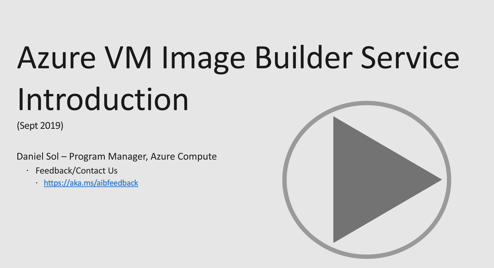

# Azure VM Image Builder Template Repo
!!!!!Azure VM Image Builder is now in PUBLIC Preview!!!!!

Get started now, this repo contains mutliple examples and test templates for Azure VM Image Builder.

What is Image Builder??
Get started with the short intro video below, or go straight to the Quick Starts below.

1. [Quick QuickStarts Examples](/quickquickstarts/readme.md).
You can run these immediately using the Azure CloudShell from the Portal, and see multiple scenarios that the VM Image Builder supports. 

2. [Azure Resource Manager (ARM) Image Builder Examples](/armTemplates/README.md). 
The beauty of these examples, they are heavily parameterized, so you just need to drop in your own details, then begin image building, or integrate them to existing pipelines.

3. Release Information

## Latest Release Information

### Timelines (updated March 2020)
GA - Q2 2020

### March 2020 Updates
It has been a busy year already, and we are so pleased to announce this new functionality:
* [Removal of Public IP address requirement, and use an existing VNET](./aibNetworking)
    * You can now allow image builder to use your existing VNET, so you can connect to existing configuration servers (DSC, Chef, Puppet etc.), file shares, or any other routable servers/services.
    * Try the end 2 end [Windows](https://github.com/danielsollondon/azvmimagebuilder/tree/master/quickquickstarts/1a_Creating_a_Custom_Win_Image_on_Existing_VNET#create-a-windows-linux-image-allowing-access-to-an-existing-azure-vnet) and [Linux](https://github.com/danielsollondon/azvmimagebuilder/tree/master/quickquickstarts/1a_Creating_a_Custom_Linux_Image_on_Existing_VNET#create-a-custom-linux-image-allowing-access-to-an-existing-azure-vnet) examples now!
* [European Region Support]()
    * We now the AIB service in *NorthEurope* and *WestEurope*! 
* [Windows Update customizer](https://github.com/danielsollondon/azvmimagebuilder/blob/f7aac8e6f57fb8ee332af3390a7da303a425d88b/quickquickstarts/1a_Creating_a_Custom_Win_Image_on_Existing_VNET/existingVNETWindows.json#L80)
    * The [community Windows Update Provisioner](https://packer.io/docs/provisioners/community-supported.html) for Packer was integrated into Image Builder, that allows Windows Updates to be installed, and handles reboots during the process. 
* ['Latest'](https://github.com/danielsollondon/azvmimagebuilder/blob/master/quickquickstarts/1a_Creating_a_Custom_Win_Image_on_Existing_VNET/existingVNETWindows.json#L47) image version support
    * Instead of you need to specify a version for Azure Market Place (AMP) images, you can now specify. When the image is created, AIB will use the latest version. This means you can rerun the same image template after the source images in AMP are updated, such as monthly. 
* [Permissions documentation](./aibPermissions.md)
    * We listened to feedback for clarity on permissions required for AIB, and be more granular on permissions required.
    * The quickstarts and solutions are being updated with new permission enablement steps over time.
* [Networking documentation](./aibNetworking)
    * We have documented details for AIB networking, options, and requirements.
* DevOps Task Update
    * [Windows Update](https://github.com/danielsollondon/azvmimagebuilder/blob/master/solutions/1_Azure_DevOps/DocsReadme.md#windows-update-task) - Support for running Windows Update at end of task
    * [Change VM size](https://github.com/danielsollondon/azvmimagebuilder/blob/master/solutions/1_Azure_DevOps/DocsReadme.md#optional-settings) - Change the VM size to make resource intensive image builds faster, and also build on specilist VM sizes, such as GPU or HPC enabled sizes.
* RHEL ISO Source Deprecation
    * We are removing this functionality from image builder, as there are now [RHEL Bring Your Own Subscription images](https://docs.microsoft.com/en-us/azure/virtual-machines/workloads/redhat/byos), please review the timelines below:
        * 31st March - Image Templates with RHEL ISO sources will now longer be accepted by the resource provider.
        * 30th April - Image Templates that contain RHEL ISO sources will not be processed any more.

The offical Microsoft docs for image builder will be updated this month to relect these updates.

### December 2019 Updates Part 2
The work never ends, latest customization support:

* [osDiskSizeGB](https://docs.microsoft.com/en-us/azure/virtual-machines/linux/image-builder-json#osdisksizegb)

* There will be more updates in January! On behalf of the team, thank you to everyone who has tried Image Builder, and given feedback, we really appreciate it. Happy Holidays!!!!

### December 2019 Updates
We constantly update the Image Builder Service, and its been a while since we summarized recent updates here:

* [PowerShell Customizer Elevated Permissions](https://docs.microsoft.com/en-us/azure/virtual-machines/linux/image-builder-json?toc=%2Fazure%2Fvirtual-machines%2Fwindows%2Ftoc.json&bc=%2Fazure%2Fvirtual-machines%2Fwindows%2Fbreadcrumb%2Ftoc.json#powershell-customizer)
    * PowerShell Support for running commands and scripts with elevated permissions
* [Checksum File Validation](https://docs.microsoft.com/en-us/azure/virtual-machines/linux/image-builder-json?toc=%2Fazure%2Fvirtual-machines%2Fwindows%2Ftoc.json&bc=%2Fazure%2Fvirtual-machines%2Fwindows%2Fbreadcrumb%2Ftoc.json#powershell-customizer)
    * PowerShell / Shell / File Customizer Support for checkSum
    * Checksum the file a file locally, then Image Builder will checksum and validate.
* [Increase Build Time](https://docs.microsoft.com/en-us/azure/virtual-machines/linux/image-builder-json?toc=%2Fazure%2Fvirtual-machines%2Fwindows%2Ftoc.json&bc=%2Fazure%2Fvirtual-machines%2Fwindows%2Fbreadcrumb%2Ftoc.json#properties-buildtimeoutinminutes)
    * The default timeout of the image is currently 4hours, but can be reduced or increased upto 16hours.
* [Change Build VM Size](https://docs.microsoft.com/en-us/azure/virtual-machines/linux/image-builder-json?toc=%2Fazure%2Fvirtual-machines%2Fwindows%2Ftoc.json&bc=%2Fazure%2Fvirtual-machines%2Fwindows%2Fbreadcrumb%2Ftoc.json#vmprofile)
    * By default Image Builder will use a "Standard_D1_v2" build VM, but you may want to use a different VM size, since you may restrict this through Azure Policy, you have customizations that are compute intensive, or you need customize images that can only be run on certain types of VM Size types, e.g. if you want to customize an Image for a GPU VM, you need a GPU VM size.
* [Windows Client / Virtual Desktop OS Support](https://docs.microsoft.com/en-us/azure/virtual-machines/windows/image-builder-overview#os-support)
    * Many customers are testing Image Builder to support customizing Windows Desktop images, see the PowerShell example on how you can get started building Win10 Images.
    * Change [this](https://github.com/danielsollondon/azvmimagebuilder/tree/master/quickquickstarts/1_Creating_a_Custom_Win_Shared_Image_Gallery_Image) quickstart to start building custom WVD images with the Shared Image Gallery.
* [DevOps Task Updates](https://github.com/danielsollondon/azvmimagebuilder/tree/master/solutions/1_Azure_DevOps#the-azure-vm-image-builder-devops-task)
    * Specify source Azure Market Place OS image versions
    * Improved performance and reliability enhancements for Windows builds
    * Improved Build Log support
        * Source Azure Market Place Image Pub/offer/SKU/Version emitted into DevOps variables.
  
* Supportability
    * Improved error messages, with log error location
    * Multiple bug and reliability enhancements
    * Support for raising image builder Microsoft support cases
    * [Join the Image Builder Community MS Teams Channel](https://aka.ms/aibfeedback)
        * Give feedback, share ideas, contact the engineering team

* [Shared Image Gallery Version Modifications](https://github.com/danielsollondon/azvmimagebuilder/tree/master/solutions/11_Modifying_SIG_Versions_Post_Build#modifying-shared-image-gallery-versions-post-image-build)
    * Support for Image Version updates post image build, such as updating regions, replicas etc is now supported.

* PowerShell examples
    * [Create a Windows Custom Image and distibute to Shared Image Gallery](https://github.com/danielsollondon/azvmimagebuilder/tree/master/quickquickstarts/1_Creating_a_Custom_Win_Shared_Image_Gallery_Image)

### May 2019 Release

* Release Date : 10th May 1000 PST
    This is an exciting release, image builder has just [PUBLIC PREVIEW](https://cloudblogs.microsoft.com/opensource/2019/05/07/announcing-the-public-preview-of-azure-image-builder/)!!!!!

    The whole team is excited to make this milestone, and thanks the Private preview community for their engagement, feedback, and helping shape the product. 

    You will be glad to know there are no API changes this month! But just wanted to share with you an exciting feature additions:

    1. [Preview Azure DevOps Extension](https://github.com/danielsollondon/azvmimagebuilder/tree/master/solutions/1_Azure_DevOps) - This simplfies using Image Builder in Azure DevOps release pipelines, you just fill in Source / Customizations / Distribute, then the task will create the image, it also will copy in you Build pipeline artifacts!!!

        It is so cool, please try it, and give us feedback.

    2. [Image Builder Public Docs](https://docs.microsoft.com/en-us/azure/virtual-machines/windows/image-builder-overview)
    
        The quickstarts are in the process of bring migrated to Azure Docs, but the quick starts will be maintained until there is a full transition, and you will be notified.

### [April 2019 Release](/aibApril2019Update.md)
* Features added (links to example config templates):
    * Patch your Windows Custom Images - select existing [Windows Custom SIG Images](https://github.com/danielsollondon/azvmimagebuilder/tree/master/quickquickstarts/8_Creating_a_Custom_Win_Shared_Image_Gallery_Image_from_SIG) and [Custom Windows Managed Images](https://github.com/danielsollondon/azvmimagebuilder/tree/master/quickquickstarts/0_Creating_a_Custom_Windows_Managed_Image)!!!
    * Seemless authentication with Azure Storage - using [Managed User-Assigned Identity](https://github.com/danielsollondon/azvmimagebuilder/tree/master/quickquickstarts/7_Creating_Custom_Image_using_MSI_to_Access_Storage) and authenticating with Azure storage accounts. 
    * [Azure Shared Image Gallery](https://github.com/danielsollondon/azvmimagebuilder/tree/master/quickquickstarts/8_Creating_a_Custom_Linux_Shared_Image_Gallery_Image_from_SIG) as a source
    * [Add in files to the image](https://github.com/danielsollondon/azvmimagebuilder/tree/master/quickquickstarts/0_Creating_a_Custom_Linux_Managed_Image)
    * Support for [long duration image builds](https://github.com/danielsollondon/azvmimagebuilder/tree/master/quickquickstarts/0_Creating_a_Custom_Linux_Managed_Image)
    * Abililty to [override the Image Builder image generalization commands](https://github.com/danielsollondon/azvmimagebuilder/blob/master/troubleshootingaib.md#vms-created-from-aib-images-do-not-create-successfully)

* [March 2019 Release](/aibMarch2019Update.md)
* Features added (links to example config templates):
    * [Windows Server Support](quickquickstarts/0_Creating_a_Custom_Windows_Managed_Image/helloImageTemplateWin.json)
    * Additional Customizers
        * [Windows PowerShell (Script and Inline)](quickquickstarts/0_Creating_a_Custom_Windows_Managed_Image/helloImageTemplateWin.json)
        * [Windows-Restart](quickquickstarts/0_Creating_a_Custom_Windows_Managed_Image/helloImageTemplateWin.json)
        * [Linux Shell Inline command support](quickquickstarts/0_Creating_a_Custom_Linux_Managed_Image/helloImageTemplateLinux.json)
    * [Image Build Logs](/troubleshootingaib.md#collecting-and-reviewing-aib-logs) - for troubleshooting
    * [Use existing Custom Managed Images as a Base Image (Currently Linux only)](quickquickstarts/5_Creating_a_Custom_Image_from_Custom_Managed_Image)
    * [Export Images to VHD](/quickquickstarts/4_Creating_a_Custom_Linux_Image_to_VHD)

4. [Troubleshooting](/troubleshootingaib.md)
