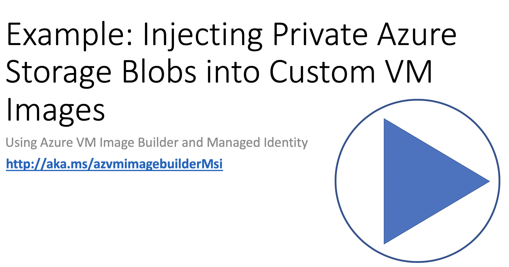

# Create a Custom Image that will use an Azure User-Assigned Managed Identity to seemlessly access files Azure Storage 

> **MAY 2020 SERVICE ALERT** - Existing users, please ensure you are compliant this [Service Alert by 26th May!!!](https://github.com/danielsollondon/azvmimagebuilder#service-update-may-2020-action-needed-by-26th-may---please-review)

AIB supports using scripts, or copying files from multiple locations, such as GitHub and Azure storage etc. 

This article shows how to create a basic customized image using the Azure VM Image Builder, where the service will use a [User-assigned Managed Identity](https://docs.microsoft.com/en-us/azure/active-directory/managed-identities-azure-resources/overview) to access files in Azure storage for the image customization, without you having to make the files publically accessible, or setting up SAS tokens.

In addition, you will not grant permissions to the AIB Service Principal, the user identity you create will be used by image builder to insert an image into an Azure Shared Image Gallery (SIG).


In the example below, you will create two resource groups, one will be used for the custom image created, and the other one will just host an Azure Storage Account, that includes a scipt file. You will create a user-assigned identity, this will be used by AIB to distribute the image, and then grant the user identity read permissions on the script file, and pass that identity to Image Builder. 

>>> Note! A PowerShell version of this quickstart is in development [here](https://github.com/danielsollondon/azvmimagebuilder/tree/master/testingArea/7_Creating_Custom_Win_Image_using_MSI_to_Access_Storage), expect this to be released v soon.

Here is a short video on how the example below works.

[
](https://youtu.be/aalpp2a8wv0)


To use this Quick Quickstarts, this can all be done using the Azure [Cloudshell from the Portal](https://azure.microsoft.com/en-us/features/cloud-shell/). Simply copy and paste the code from here, at a miniumum, just update the **subscriptionID** variable below.

## Step 1: Enable Prereqs

Happy Image Building!!!

### Register for Image Builder / VM / Storage Features
```bash
az feature register --namespace Microsoft.VirtualMachineImages --name VirtualMachineTemplatePreview

az feature show --namespace Microsoft.VirtualMachineImages --name VirtualMachineTemplatePreview | grep state

# wait until it says registered

# check you are registered for the providers

az provider show -n Microsoft.VirtualMachineImages | grep registrationState
az provider show -n Microsoft.Storage | grep registrationState
az provider show -n Microsoft.Compute | grep registrationState
az provider show -n Microsoft.KeyVault | grep registrationState
```

If they do not saw registered, run the commented out code below.
```bash
## az provider register -n Microsoft.VirtualMachineImages
## az provider register -n Microsoft.Storage
## az provider register -n Microsoft.Compute
## az provider register -n Microsoft.KeyVault

```

### Set Permissions & Create Resource Group for Image Builder Images

```bash
# set your environment variables here!!!!

# image resource group
imageResourceGroup=aibmdimsi00022

# storage resource group
strResourceGroup=aibmdimsistor

# location (see possible locations in main docs)
location=WestUS2

# your subscription
# get the current subID : 'az account show | grep id'
subscriptionID=$(az account show | grep id | tr -d '",' | cut -c7-)

# additional region to replication image to
additionalregion=eastus

# name of the shared image gallery, e.g. myCorpGallery
sigName=myaibsig

# name of the image definition to be created, e.g. ProdImages
imageDefName=ubuntu1804images

# image distribution metadata reference name
runOutputName=u1804ManImgMsiro

# create resource group for Image Template
az group create -n $imageResourceGroup -l $location
```
## Step 2: Create a user identify and assign permissions for the resource group where the image will be created

### Create User-Assigned Managed Identity and Grant Permissions 
For more information on User-Assigned Managed Identity, see [here](https://docs.microsoft.com/en-us/azure/active-directory/managed-identities-azure-resources/qs-configure-cli-windows-vm#user-assigned-managed-identity).

```bash
# create user assigned identity for image builder to access the storage account where the script is located
idenityName=aibBuiUserId$(date +'%s')
az identity create -g $imageResourceGroup -n $idenityName

# get identity id
imgBuilderCliId=$(az identity show -g $imageResourceGroup -n $idenityName | grep "clientId" | cut -c16- | tr -d '",')

# get the user identity URI, needed for the template
imgBuilderId=/subscriptions/$subscriptionID/resourcegroups/$imageResourceGroup/providers/Microsoft.ManagedIdentity/userAssignedIdentities/$idenityName

# download preconfigured role definition example
curl https://raw.githubusercontent.com/danielsollondon/azvmimagebuilder/master/solutions/12_Creating_AIB_Security_Roles/aibRoleImageCreation.json -o aibRoleImageCreation.json

imageRoleDefName="Azure Image Builder Image Def"$(date +'%s')

# update the definition
sed -i -e "s/<subscriptionID>/$subscriptionID/g" aibRoleImageCreation.json
sed -i -e "s/<rgName>/$imageResourceGroup/g" aibRoleImageCreation.json
sed -i -e "s/Azure Image Builder Service Image Creation Role/$imageRoleDefName/g" aibRoleImageCreation.json

# create role definitions
az role definition create --role-definition ./aibRoleImageCreation.json

# grant role definition to the user assigned identity
az role assignment create \
    --assignee $imgBuilderCliId \
    --role $imageRoleDefName \
    --scope /subscriptions/$subscriptionID/resourceGroups/$imageResourceGroup
```

## Step 3: Create Azure Shared Image Gallery & Definition
```bash
# create SIG
az sig create \
    -g $imageResourceGroup \
    --gallery-name $sigName

# create SIG image definition

az sig image-definition create \
   -g $imageResourceGroup \
   --gallery-name $sigName \
   --gallery-image-definition $imageDefName \
   --publisher corpIT \
   --os-state Generalized \
   --offer myOffer \
   --sku 18.04-LTS \
   --os-type Linux

```


## Step 4: Create another Resource Group for a Storage Account to host scripts
```bash
# create resource group for the script storage
az group create -n $strResourceGroup -l $location

# script storage account
scriptStorageAcc=aibstorscript$(date +'%s')

# script container
scriptStorageAccContainer=scriptscont$(date +'%s')

# script url
scriptUrl=https://$scriptStorageAcc.blob.core.windows.net/$scriptStorageAccContainer/customizeScript.sh

# create storage account and blob in resource group
az storage account create -n $scriptStorageAcc -g $strResourceGroup -l $location --sku Standard_LRS

az storage container create -n $scriptStorageAccContainer --fail-on-exist --account-name $scriptStorageAcc

# copy in an example script from the github repo 
az storage blob copy start --destination-blob customizeScript.sh \
                           --destination-container $scriptStorageAccContainer \
                           --account-name $scriptStorageAcc \
                           --source-uri https://raw.githubusercontent.com/danielsollondon/azvmimagebuilder/master/quickquickstarts/customizeScript.sh
## wait a minute

# assign the identity permissions to the storage account, so it can read the script blob
az role assignment create \
    --assignee $imgBuilderCliId \
    --role "Storage Blob Data Reader" \
    --scope /subscriptions/$subscriptionID/resourceGroups/$strResourceGroup/providers/Microsoft.Storage/storageAccounts/$scriptStorageAcc/blobServices/default/containers/$scriptStorageAccContainer 
```

## Step 5: Configure the Image Builder Template

```bash
# download the example and configure it with your vars

curl https://raw.githubusercontent.com/danielsollondon/azvmimagebuilder/master/quickquickstarts/7_Creating_Custom_Image_using_MSI_to_Access_Storage/helloImageTemplateMsi.json -o helloImageTemplateMsi.json

sed -i -e "s/<subscriptionID>/$subscriptionID/g" helloImageTemplateMsi.json
sed -i -e "s/<rgName>/$imageResourceGroup/g" helloImageTemplateMsi.json
sed -i -e "s/<imageName>/$imageName/g" helloImageTemplateMsi.json
sed -i -e "s%<scriptUrl>%$scriptUrl%g" helloImageTemplateMsi.json
sed -i -e "s%<imgBuilderId>%$imgBuilderId%g" helloImageTemplateMsi.json
sed -i -e "s%<runOutputName>%$runOutputName%g" helloImageTemplateMsi.json

sed -i -e "s/<imageDefName>/$imageDefName/g" helloImageTemplateMsi.json
sed -i -e "s/<sharedImageGalName>/$sigName/g" helloImageTemplateMsi.json

sed -i -e "s/<region1>/$location/g" helloImageTemplateMsi.json
sed -i -e "s/<region2>/$additionalregion/g" helloImageTemplateMsi.json
sed -i -e "s/<runOutputName>/$runOutputName/g" helloImageTemplateMsi.json

```

## Step 5a: Submit the Image Configuration to the VM Image Builder Service

```bash
az resource create \
    --resource-group $imageResourceGroup \
    --properties @helloImageTemplateMsi.json \
    --is-full-object \
    --resource-type Microsoft.VirtualMachineImages/imageTemplates \
    -n helloImageTemplateMsi01
```

# Step 6: Start the image build
```bash
az resource invoke-action \
     --resource-group $imageResourceGroup \
     --resource-type  Microsoft.VirtualMachineImages/imageTemplates \
     -n helloImageTemplateMsi01 \
     --action Run 

# wait approx 20mins (it includes replication time westus2 > eastus)
```


## Step 7 : Create the VM

```bash
az vm create \
  --resource-group $imageResourceGroup \
  --name aibImgVm00 \
  --admin-username aibuser \
  --image $imageName \
  --location $location \
  --generate-ssh-keys

# and login...

ssh aibuser@<pubIp>

You should see the image was customized with a Message of the Day as soon as your SSH connection is established!

*******************************************************
**            This VM was built from the:            **
...

```

## Clean Up
```bash
# delete permissions asssignments, roles and identity
az role assignment delete \
    --assignee $imgBuilderCliId \
    --role "$imageRoleDefName" \
    --scope /subscriptions/$subscriptionID/resourceGroups/$imageResourceGroup

az role definition delete --name "$imageRoleDefName"

az identity delete --ids $imgBuilderId


# delete AIB Template
az resource delete \
    --resource-group $imageResourceGroup \
    --resource-type Microsoft.VirtualMachineImages/imageTemplates \
    -n helloImageTemplateMsi01

# get image version created by AIB, this always starts with 0.*
sigDefImgVersion=$(az sig image-version list \
   -g $imageResourceGroup \
   --gallery-name $sigName \
   --gallery-image-definition $imageDefName \
   --subscription $subscriptionID --query [].'name' -o json | grep 0. | tr -d '"')

# delete image version
az sig image-version delete \
   -g $imageResourceGroup \
   --gallery-image-version $sigDefImgVersion \
   --gallery-name $sigName \
   --gallery-image-definition $imageDefName \
   --subscription $subscriptionID

# delete image definition
az sig image-definition delete \
   -g $imageResourceGroup \
   --gallery-name $sigName \
   --gallery-image-definition $imageDefName \
   --subscription $subscriptionID

# delete SIG
az sig delete -r $sigName -g $imageResourceGroup

# delete resource groups
az group delete -n $imageResourceGroup

az group delete -n $strResourceGroup

```

## Next Steps
If you loved or hated Image Builder, please go to next steps to leave feedback in the github issues, or try more examples.