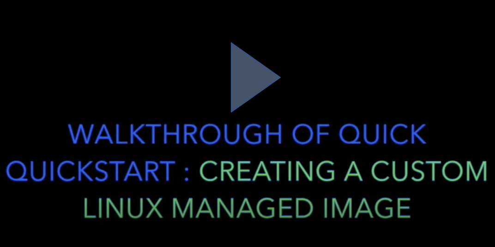

# Azure VM Image Builder Quick QuickStarts

Welcome to the Azure VM Image Builder QuickStarts, these are some key features you can test using Azure CloudShell in the Portal, Azure CLI, PowerShell.

> **MAY 2020 SERVICE ALERT** - Existing users, please ensure you are compliant this [Service Alert by 26th May!!!](https://github.com/danielsollondon/azvmimagebuilder#service-update-may-2020-action-needed-by-26th-may---please-review)

**First time using Image Builder??** 

Get started with the short walkthrough video below, or go straight to the Quick Starts below.

**Second time using Image Builder??**  
We constantly update features, see the [Latest Release Information](https://github.com/danielsollondon/azvmimagebuilder#latest-release-information)!

We are always adding new quick starts, but these are some key examples:

1. [Create a Custom Linux Image from an Azure Platform Vanilla OS Image.](./0_Creating_a_Custom_Linux_Managed_Image/readme.md)

2. [Create a Custom Windows Image from an Azure Platform Vanilla OS Image.](./0_Creating_a_Custom_Windows_Managed_Image/readme.md)

3. [Create a Custom Linux Image, then Distribute and Version over Multiple Regions.](./1_Creating_a_Custom_Linux_Shared_Image_Gallery_Image/readme.md)

4. [Creating a custom RHEL image using a RHEL ISO where you can use eligible Red Hat licenses.](./2_Creating_a_Custom_Image_using_Red_Hat_Subscription_Licences/readme.md)  

5. [Create a Custom Linux Image from an Existing Custom Managed Image.](./5_Creating_a_Custom_Image_from_Custom_Managed_Image/readme.md)

6. [Create a Custom Linux Image and Export to VHD](./4_Creating_a_Custom_Linux_Image_to_VHD/readme.md)

**Permissions Explained and Troubleshooting**
* [Permissions Explained](https://github.com/danielsollondon/azvmimagebuilder/blob/master/aibPermissions.md)>>>>>

* [Troubleshooting Guide & Log Locations](https://github.com/danielsollondon/azvmimagebuilder/blob/master/troubleshootingaib.md)

** Note: The quickstarts are designed to show you the different types of configuration you can have, many of these are supported on Windows and Linux, there will be more Windows examples soon!!

Any questions or feedback, please [here](https://aka.ms/aibfeedback), the Azure Image Builder Dev team is there during the week, Pacific time.

These are designed to get you started quickly, where at a minimum you just need to supply your subscriptionID (except for the RHEL example), showing you how the Azure VM Image Builder can be used to build images to meet these requirements:

* Security & Compliance - e.g. building corporate golden images, that meet your organizations security and compliance requirements.
* Licensing - e.g. building RHEL images using your eligible Red Hat Subcription licenses.
* Performance - e.g. creating images with applications pre-installed
* Management - e.g. managing images updates and global region replication

## Next Steps
If you loved or hated Image Builder, please go to next steps to leave feedback, contact dev team, more documentation, or try more examples [here](../quickquickstarts/nextSteps.md)
