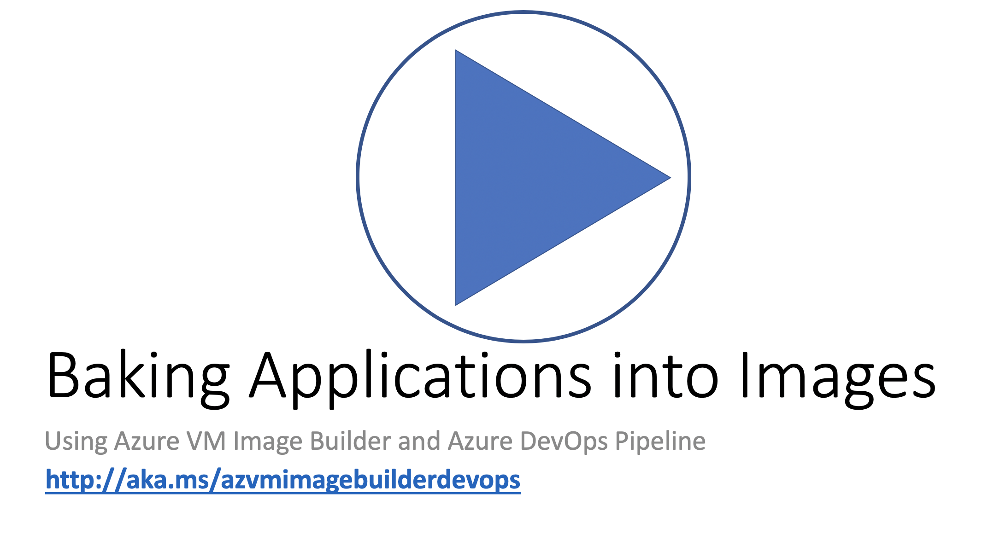

# Bake your application into your image and distribute  

>>NOTE: This is Alpha code/documentation and still being tested, do not use! Testing to complete August 2019.

## Overview
There are many occasions where an application owner will want to test and deploy changes into custom images, these could be application changes, image updates etc. 

In this end to end example, we are going to demostrate how you can use Azure DevOps to take your build artifacts from your repo, and inject them into a VM image, so you can install, configure your application, and OS.

Here is a complete walkthrough, step by step video on how the example below.

[
](https://youtu.be/lqIA0VHe5Do)

## Prerequisites
1. Ensure you have registered for the Image Builder and enable requirements (see code below).
2. You must have a VSTS DevOps account
3. Install the extension from [Visual Studio Marketplace](https://marketplace.visualstudio.com/azuredevops), DevOps, search for 'Image Builder.'
4. Create a Resource Group(RG) - this will be used for image distribution (see code below).
5. Create Azure Shared Image Gallery (SIG) and Image Definition – this will be created in the RG above (see code below).
6. Create a storage account – is used transfer the repo artifacts from the DevOps task to the image (see code below).

### Code to do steps 1 - Register and enable requirements
```bash
az feature register --namespace Microsoft.VirtualMachineImages --name VirtualMachineTemplatePreview

az feature show --namespace Microsoft.VirtualMachineImages --name VirtualMachineTemplatePreview | grep state

# register and enable for shared image gallery
az feature register --namespace Microsoft.Compute --name GalleryPreview

# wait until it says registered

# check you are registered for the providers
az provider show -n Microsoft.VirtualMachineImages | grep registrationState
az provider show -n Microsoft.Storage | grep registrationState
az provider show -n Microsoft.Compute | grep registrationState
az provider show -n Microsoft.KeyVault | grep registrationState
```

If they do not saw registered, run the commented out code below.
```bash
## az provider register -n Microsoft.VirtualMachineImages
## az provider register -n Microsoft.Storage
## az provider register -n Microsoft.Compute
## az provider register -n Microsoft.KeyVault

```

### Code to do steps 4 to 6
```bash
# Setup environment variables
aibResourceGroup=aibDevOpsImg

# location of resource group
location=WestUS2

# set your subscription
# get the current subID : 'az account show | grep id'
# or you can use this: subscriptionID=$(az account show | grep id | tr -d '",' | cut -c7-)

subscriptionID=<INSERT YOUR SUBSCRIPTION ID HERE>
# name of the shared image gallery, e.g. myCorpGallery
sigName=devOpsSIG

# name of the image definition to be created, e.g. ProdImages
imageDefName=winSvrimages


# create resource group
az group create -n $aibResourceGroup -l $location

# create SIG
az sig create \
    -g $aibResourceGroup \
    --gallery-name $sigName

# create SIG image definition

az sig image-definition create \
   -g $aibResourceGroup \
   --gallery-name $sigName \
   --gallery-image-definition $imageDefName \
   --publisher corpIT \
   --offer myOffer \
   --sku 2019 \
   --os-type Windows

# assign the image builder spn rights to inject the image into the chosen resource group
az role assignment create \
    --assignee cf32a0cc-373c-47c9-9156-0db11f6a6dfc \
    --role Contributor \
    --scope /subscriptions/$subscriptionID/resourceGroups/$aibResourceGroup

# staging storage account
stagingStorageAcc=aibstagstor$(date +'%s')

# create storage account and blob in resource group
az storage account create -n $stagingStorageAcc -g $aibResourceGroup -l $location --sku Standard_LRS

```

## Create a DevOps Project 
At the VSTS home page, 'Create Project', call it 'AppsAndImageBuilder'.

## Create Repo
* Go to 'Repos', select initialize
* Create a directory in the Repo, `webApp`
* Copy the raw contents of the two files in the `webApp` directory, from the [quick starts repo](https://github.com/danielsollondon/azvmimagebuilder/tree/master/solutions/1_Azure_DevOps/webApp). Note, remember to switch to 'Raw' content view!

## Create a Release Pipeline
* Go to 'Pipelines' > Releases

### Add Pipeline Artifacts
You will need Release Pipeline, then connect the Artifacts to the repo you created in the step before, you have the option to also connect a Build Pipeline too.

### Create Pipeline Stages
Go into the job, leave the Agent defaults as is, then add a task.
Go to the Release Pipeline > Edit. On the User Agent, click the '+', and search for 'Image Builder', then add it.


Add these settings:
* Azure Subscription - This should be the subscription of the RG
* Resource group - This should be the RG you created earlier
* Location - Location of Image Builder Service location you will use
* Image type - For this example, we will use MarketPlace
* Base image - Select 'Windows 2019-Datacenter', the task will use the latext version
* Provisioner - Select 'PowerShell', as this is going to be a Windows base image
* Build path - Using the control (...), navigate to this location: `$(System.DefaultWorkingDirectory)/_BakeAppIntoImage/webApp`
* Inline customization script - Set this to: `& 'c:\buildArtifacts\webApp\webConfig.ps1'`
* Storage account - Select from the drop down `aibstagstor*`
* Distribute type - Select 'Shared Image Gallery'
* Image id for Shared Gallery Image - You can get this from the SIG properties in the Az Portal, or run this code, and copy and paste:
```bash
echo /subscriptions/$subscriptionID/resourceGroups/$aibResourceGroup/providers/Microsoft.Compute/galleries/$sigName/images/$imageDefName 
```
* Regions separated by comma - Add `westus2,eastus`, note, you will pay for replication and storage costs for images, so if you do not to use eastus, just remove it.
* Save all the changes

### Start the Image Build
* Click on 'Create Release', then 'Create'.

About 30-40 later, the image should be distributed to both US regions.

## Testing the Image

```bash
# setup SIG Image Version ResourceID
image="/subscriptions/$subscriptionID/resourceGroups/$aibResourceGroup/providers/Microsoft.Compute/galleries/$sigName/images/$imageDefName/versions/latest"

# set vm name
vmName=win2019svrApp

# create VM
az vm create \
  --resource-group $aibResourceGroup \
  --name $vmName \
  --admin-username azureuser \
  --image $image \
  --location $location \
  --admin-password anotherPassword123!

# open ports
az vm open-port -g $aibResourceGroup -n $vmName --port 8080 --priority 100

```

Take the IP Address from the CLI output, then, from your local browser, goto: `http://<ipAddress>:8080`, if the image customization has worked, you should see a webpage.

## Clean Up

* Delete VSTS Project
    * Organization Settings > Projects > highlight Project '...',then 'Delete' 

```bash
# BEWARE : This is DELETING the Image created for you, be sure this is what you want!!!

# delete AIB Template
az resource delete \
    --resource-group $aibResourceGroup \
    --resource-type Microsoft.VirtualMachineImages/imageTemplates \
    -n helloImageTemplateforWinSIG01

# get image version created by AIB, this always starts with 0.*
sigDefImgVersion=$(az sig image-version list \
   -g $aibResourceGroup \
   --gallery-name $sigName \
   --gallery-image-definition $imageDefName \
   --subscription $subscriptionID --query [].'name' -o json | grep 0. | tr -d '"')

# delete image version
az sig image-version delete \
   -g $aibResourceGroup \
   --gallery-image-version $sigDefImgVersion \
   --gallery-name $sigName \
   --gallery-image-definition $imageDefName \
   --subscription $subscriptionID

# delete image definition
az sig image-definition delete \
   -g $aibResourceGroup \
   --gallery-name $sigName \
   --gallery-image-definition $imageDefName \
   --subscription $subscriptionID

# delete SIG
az sig delete -r $sigName -g $aibResourceGroup

# delete RG
az group delete -n $aibResourceGroup -y
```

## Next Steps
If you loved or hated Image Builder, please go to next steps to leave feedback, contact dev team, more documentation, or try more examples [here](../../quickquickstarts/nextSteps.md)]

